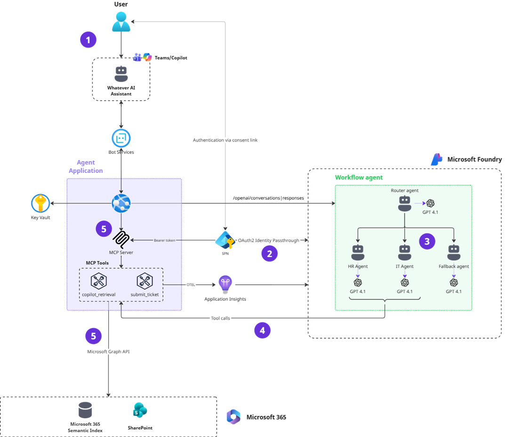
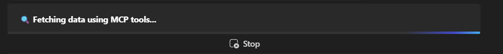
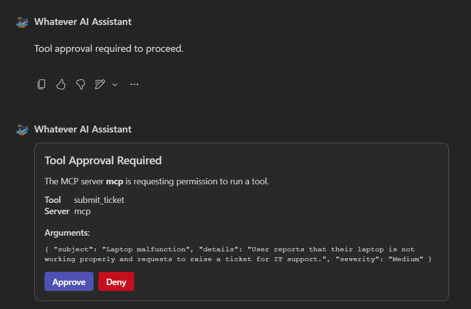
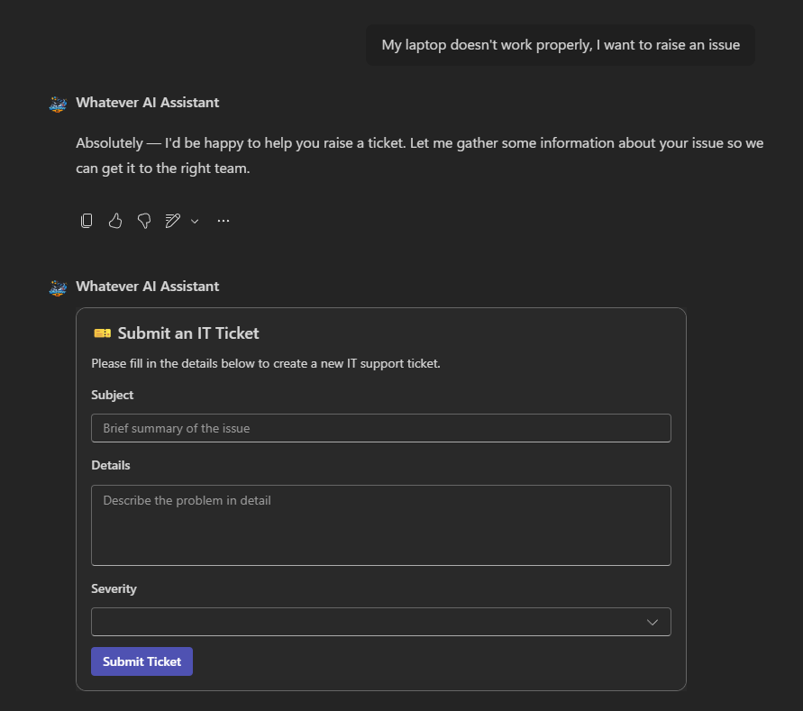
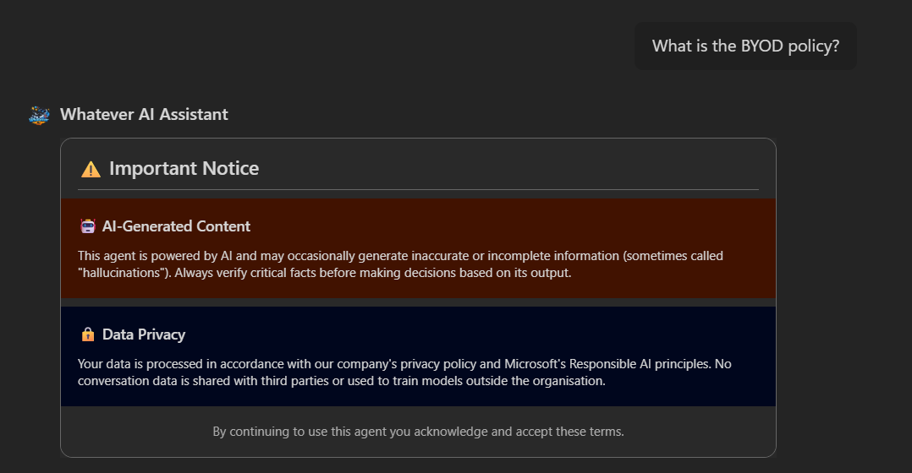
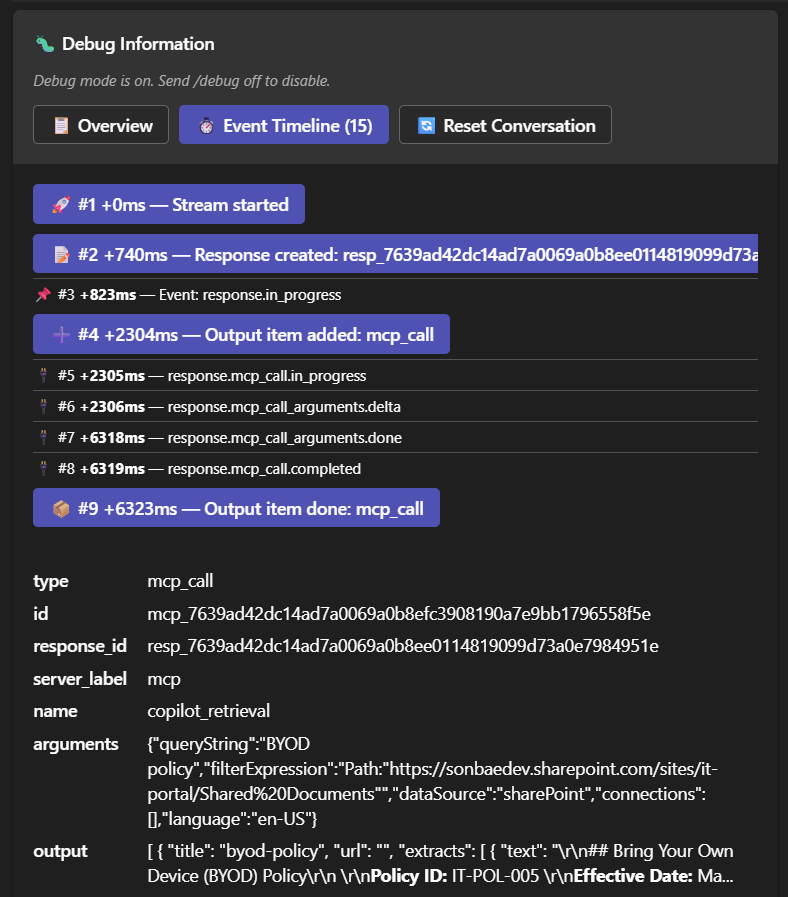
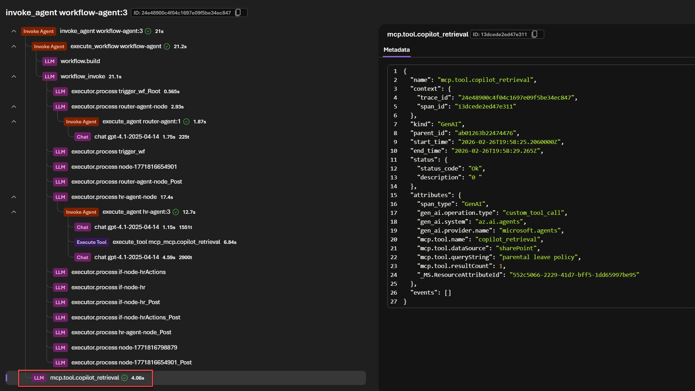

<p align="center">
  
</p>

<h1 align="center">Whatever AI Assistant (WAIA)</h1>

<p align="center">
  <strong>🏢 Enterprise Agents</strong> · <a href="https://github.com/microsoft/agentsleague">Microsoft Agents League Contest</a> — February 2026
</p>

<p align="center">
  <em>"One agent to greet them, many agents behind the scenes — whatever your question, WAIA has you covered." 🚀</em>
</p>

---

## What is this?

A **production-ready multi-agent system** that answers HR and IT questions through Microsoft 365 Copilot Chat and Microsoft Teams. Built with Microsoft Foundry Agent Service, Microsoft 365 Agents SDK, and a custom MCP server.

## Key Highlights

| Feature | Description |
| --- | --- |
| **Multi-Agent Routing** | A workflow agent routes queries to specialized HR, IT, or Fallback agents — transparently to the user |
| **Streaming Responses** | OpenAI Responses API + Teams streaming for a smooth conversational experience |
| **MCP Server with OAuth** | Custom MCP server secured via [OAuth Identity Passthrough](https://learn.microsoft.com/en-us/azure/ai-foundry/agents/how-to/mcp-authentication?view=foundry#oauth-identity-passthrough) — delegated permissions only |
| **Read & Write MCP Tools** | `copilot_retrieval` for SharePoint knowledge retrieval · `submit_ticket` for IT ticket submission |
| **Adaptive Cards** | Debug card, ticket form, disclaimer, and MCP tool approval — all as rich interactive cards |
| **Custom Disclaimer** | Dynamic Adaptive Card disclaimer on first interaction or new chat sessions |
| **Human in the Loop** | MCP tool approval flow via dynamic Adaptive Cards |
| **Built-in Debug Mode** | `/debug on\|off` command to inspect agent reasoning directly in Teams/Copilot |
| **OpenTelemetry** | Telemetry integration for MCP tool calls, responses, and errors — visible in the Foundry portal |
| **Citations** | Proper handling of agent references for both Teams and Copilot experiences |

## Full Documentation

**👉 [Browse the full documentation](https://whatever-ai-assistant-docs.azurewebsites.net/)** for detailed explanations, screenshots, architecture overview, deployment guide, and implementation strategies.

> The documentation can also be started locally by running these commands from the `/documentation` folder

```
npm i
npm run start
```


## Architecture at a Glance

<p align="center">
  
</p>

## Screenshots

<table>
  <tr>
    <td align="center" width="50%">
      <strong>Streaming Experience</strong><br/><br/>
      
    </td>
    <td align="center" width="50%">
      <strong>MCP Tool Approval (Human in the Loop)</strong><br/><br/>
      
    </td>
  </tr>
  <tr>
    <td align="center">
      <strong>IT Ticket Submission</strong><br/><br/>
      
    </td>
    <td align="center">
      <strong>Custom Disclaimer</strong><br/><br/>
      
    </td>
  </tr>
  <tr>
    <td align="center">
      <strong>Built-in Debug Mode</strong><br/><br/>
      
    </td>
    <td align="center">
      <strong>OpenTelemetry Traces</strong><br/><br/>
      
    </td>
  </tr>
</table>

## Design Principles

- 🚀 **Production-ready** — Fully automated deployment to Azure, not just a demo
- 🔧 **Flexible & extensible** — Add new agents (Finance, Legal, etc.) without changing the user experience
- 💡 **Real-world insights** — Practical tips from actual implementation

## Author

**Franck Cornu** — Microsoft 365 Copilot/AI Architect · M365 Development · Copilot Extensibility

[LinkedIn](https://www.linkedin.com/in/franckcornu) · [Blog](https://blog.franckcornu.com/)

---

## License

See [LICENSE](./LICENSE) for details.
