import AgentLogo from './img/agent_logo.png';
import Tabs from '@theme/Tabs';
import TabItem from '@theme/TabItem';
import CustomDisclaimer from './img/custom_disclaimer.png';
import McpAuthentication from './img/mcp_auth1.png';
import FoundryAgentServiceAuth from './img/agent_service_auth.png';
import RagPattern from './img/rag_pattern_copilot.png';
import TicketSubmission from './img/ticket_submission.png';
import OpenTelemetry from './img/open_telemetry.png';
import DebugMode from './img/debug_mode.png';
import StreamingExperience from './img/streaming_experience.png';
import CopilotCitations from './img/citations_copilot.png';
import TeamsCitations from './img/teams_citations.png';
import ToolApproval from './img/tool_approval.png';
import Franck from './img/franck.png';

# Meet the Whatever AI Assistant!

  

    Built as part of the <a href="https://github.com/microsoft/agentsleague">Microsoft Agents League Contest</a> — February 2026.
    
Agent category: <strong>Enterprise Agents</strong>

  

    

    
    
Created by

    
Franck Cornu

    
Microsoft 365 Copilot/AI Architect · M365 Development · Copilot Extensibility

    

        <a href="https://www.linkedin.com/in/franckcornu" target="_blank" className="text-sm font-medium text-purple-600 dark:text-purple-400 hover:underline">LinkedIn</a>
        ·
        <a href="https://blog.franckcornu.com/" target="_blank" className="text-sm font-medium text-purple-600 dark:text-purple-400 hover:underline">Blog</a>
    

  

    "One agent to greet them, many agents behind the scenes — whatever your question, WAIA has you covered." 🚀
  

---

## Overview

This agent was developed for the [Microsoft Agents League Contest](https://github.com/microsoft/agentsleague) held in February 2026. It demonstrates a **multi-agent system** answering HR and IT questions, leveraging Microsoft Foundry Agent Service, Microsoft 365 Copilot, Microsoft 365 Agents SDK, and an MCP server. It has been designed with the following concerns in mind:

- 🚀 **Production-ready** — Not just screenshots or a "works on my machine" sample. A full working solution with **fully automated deployment** in an Azure environment you can replicate in your own company.
- 🔧 **Flexible & extensible** — Need a Finance agent, a Legal agent, or a Facilities agent? Just plug it in. The architecture **scales effortlessly** on both the data side — thanks to the Copilot Retrieval API supporting multiple connector types (built-in or custom) — and the agent side, where adding a new workflow node with its own model, instructions, and tools is straightforward. It adapts to a wide range of use cases.
- 💡 **Real-world insights** — Tips, tricks, and strategies from actual implementation — not just theory. See [Implementation strategies](./dev-notes.mdx).

  

    🎬
    <h3 className="text-xl font-bold mt-2 mb-1 text-transparent bg-clip-text bg-gradient-to-r from-purple-600 to-cyan-500">See it in action</h3>
    
Watch the Whatever AI Assistant in both Microsoft Teams and Microsoft 365 Copilot

  

  

    

      
📺 Teams experience

      <iframe width="100%" height="250" src="https://www.youtube.com/embed/IVf5V2sxwLA" title="Teams demo video" frameBorder="0" allow="accelerometer; autoplay; clipboard-write; encrypted-media; gyroscope; picture-in-picture" allowFullScreen className="rounded-xl shadow-xl" />
    

    

      
💡 Copilot experience

      <iframe width="100%" height="250" src="https://www.youtube.com/embed/wl9O4dxJy6U" title="Copilot demo video" frameBorder="0" allow="accelerometer; autoplay; clipboard-write; encrypted-media; gyroscope; picture-in-picture" allowFullScreen className="rounded-xl shadow-xl" />
    

  

The complete architecture can be seen [here](./solution-overview.mdx).

Here's what the **Whatever AI Assistant** brings to the table:

---

### Multi-Agent Routing with Streaming

The solution uses a multi-agent system to address user queries across various topics (HR & IT in this sample). We leverage the **Copilot Retrieval API** for content grounding, narrowed to specific domains and configurations. The multi-agent system is orchestrated by a **workflow agent** that routes user queries to the appropriate specialist agent. Below is a visual representation of the workflow:

```mermaid
flowchart LR
    subgraph notes1 [" "]
        direction TB
        N1["💡 The router agent outputs a JSON object according to a specific schema so we can filter on properties."]
    end

    subgraph workflow [" "]
        direction TB
        A([🟢 OnConversationStart]) --> B["🔀 Router Agent (router-agent)"]
        B --> C{Query Category}
        C -- "Human Resources" --> D["📋 HR Agent (hr-agent)"]
        C -- "Information Technology" --> E["🖥️ IT Agent (it-agent)"]
        C -- "else" --> F["🛡️ Fallback Agent (fallback-agent)"]
        D --> G([🔴 End Conversation])
        E --> G
        F --> G
    end

    subgraph notes2 [" "]
        direction TB
        N2["🔧 HR and IT agents have an MCP tool they can use to accomplish their tasks."]
        N3["🚫 Fallback agent to nicely handle every non IT or HR question."]
    end

    N1 -.- B
    N2 -.- D
    N2 -.- E
    N3 -.- F

    style notes1 fill:none,stroke:none
    style notes2 fill:none,stroke:none
    style workflow fill:none,stroke:none
    style A fill:#22c55e,color:#fff,stroke:#16a34a
    style B fill:#8b5cf6,color:#fff,stroke:#7c3aed
    style C fill:#f59e0b,color:#fff,stroke:#d97706
    style D fill:#3b82f6,color:#fff,stroke:#2563eb
    style E fill:#06b6d4,color:#fff,stroke:#0891b2
    style F fill:#ef4444,color:#fff,stroke:#dc2626
    style G fill:#6b7280,color:#fff,stroke:#4b5563
    style N1 fill:#fef3c7,color:#92400e,stroke:#f59e0b,stroke-dasharray: 5 5
    style N2 fill:#fef3c7,color:#92400e,stroke:#f59e0b,stroke-dasharray: 5 5
    style N3 fill:#fef3c7,color:#92400e,stroke:#f59e0b,stroke-dasharray: 5 5
```

For instance the question "_How can I reset my password?_" would be routed to the IT agent, while "_What is the leave policy?_" would be routed to the HR agent without the user noticing.

To improve user experience, we use the **OpenAI Responses API** streaming capability coupled with **Teams streaming**:

    

    

:::info LLM Model
We use **GPT 4.1** for all the agents as it is sufficiently capable of handling both the routing and the question-answering tasks in this scenario. However, the architecture is model-agnostic, so you can choose different models for different agents based on their specific needs and complexity
:::

---

### Secure MCP Server with OAuth Identity Passthrough

Leverage the Agent Service MCP [OAuth Identity Passthrough](https://learn.microsoft.com/en-us/azure/ai-foundry/agents/how-to/mcp-authentication?view=foundry#oauth-identity-passthrough) feature to securely make requests **on behalf of the current user** through MCP tools.

    
    

---

### Write Operations Through MCP Tools

The solution showcases how to integrate LLM and Teams/Copilot channels seamlessly for **information gathering** — for instance, collecting specific details for a ticket through a controlled form after a user request.

    

---

### Custom Disclaimer on New Conversation

A custom disclaimer is displayed as an Adaptive Card on first interaction or new chat sessions to set expectations with users. It enhances the default Copilot/Teams disclaimer feature, tailored to company requirements.

    

---

### Human in the Loop — MCP Tool Approval

Catch tool approval requests from the agent and integrate an approval process directly in Teams or Copilot via a dynamic Adaptive Card.

    

:::note
Tool approval is only supported by `prompt` agents, not workflow agents.
:::

---

### Built-in Debug Mode

Knowing *why* your agent gave a wrong answer is key to improving it. This solution includes a special **`/debug on|off`** command that displays the agent's reasoning and steps taken for each query, right in the Teams or Copilot channel via an Adaptive Card. This avoids costly back-and-forth with the analytics backend and lets you quickly spot and fix issues in the agent configuration, tools, or knowledge base.

    

---

### OpenTelemetry Integration for MCP Tools

The solution demonstrates how to integrate **OpenTelemetry** with HTTP headers with propagation (`traceparent`) in MCP tools to capture detailed telemetry for all interactions with the MCP server — including tool calls, responses, and errors. This allows developers to monitor and troubleshoot their agents more effectively in addition to the Agent Service builtin open telemetry integration, with insights directly integrated into the **Foundry portal** via Application Insights.

    

---

### Citations Handling

The solution properly handles links and references sent by the agent for both **Teams** and **Copilot** experiences:

    
    

---

## More than a sample, a reusable pattern!

  

    This solution is more than a sample — it's a reusable pattern you can apply in your own company.
  

We provide a full end-to-end working implementation of a multi-agent system integrated with Microsoft 365 Copilot Chat and Microsoft Teams, leveraging Microsoft Foundry workflow agents and the Microsoft Graph API. The solution features a secure OAuth integration for external MCP server interactions, multiple Adaptive Cards for enhanced user experience, and a connected agents architecture to handle different types of employee inquiries.

> Why this pattern matters?

<Tabs>
  <TabItem value="anti-sprawl" label="🧩 Anti-Agent Sprawl" default>

By using agent service and workflow agents, it maintains one facade with a more complex backend of agents that can be updated and improved without impacting the user experience. The user doesn't need to know about every single agent the company developed. Companies tend to multiply agents thanks to all the tools we have now to create ones (Copilot Studio, SharePoint agents, etc.). It can become complicated for users to know which agent to ask for what.

  </TabItem>
  <TabItem value="enterprise" label="🏢 Enterprise Grade with Foundry Agent Service">

Using Microsoft Foundry Agent Service offloads many time-consuming aspects of developing AI solutions. It streamlines many aspects of agent development for common requirements, such as:
- Agent configuration and deployment.
- Standalone agents or multi-agent solutions via workflows.
- Support for private networking scenarios to comply with hard environment constraints.
- Fine-tuning capabilities for specific base models.
- **Agent testability via built-in and customizable evaluation tools.**
- Built-in guardrails.
- Built-in memory management (short term/long term).
- **Monitoring via built-in integration with Azure Monitor/Application Insights and OpenTelemetry.**

Because it is an Azure resource like any other, it also means all the infrastructure provisioning can be automated using Infrastructure as Code (IaC) tools like Bicep or Terraform, which is essential for maintaining consistency across different environments (development, testing, production).

  </TabItem>
  <TabItem value="copilot" label="💡 Maximize Copilot Investment">

When your agents need Microsoft 365 data (e.g., SharePoint documents), **use the built-in Copilot stack** — not a custom storage solution. The [Copilot Retrieval API](https://learn.microsoft.com/en-us/microsoft-365-copilot/extensibility/api/ai-services/retrieval/overview) gives you direct access to the [Microsoft 365 semantic index](https://learn.microsoft.com/en-us/microsoftsearch/semantic-index-for-copilot), which is already indexing your tenant's content behind the scenes.

**Why built-in over custom?**

| | Built-in (Copilot Connectors) | Custom (e.g., Azure AI Search) |
| --- | --- | --- |
| **Security & compliance** | ✅ Automatic — permissions, sensitivity labels, and data residency handled by M365 | ❌ You must replicate permission enforcement and keep it in sync at all times |
| **Cost** | ✅ Already included with Copilot licenses | ❌ Additional infrastructure and maintenance costs |
| **Reusability** | ✅ Same connectors work across custom engine agents, Copilot Studio, and Agent Builder | ❌ Tied to your specific implementation |
| **Maintenance** | ✅ Microsoft handles scaling, updates, and optimizations | ❌ You own the full lifecycle |
| **Indexing control** | ❌ Opaque — no control over chunking or embeddings | ✅ Full control over the indexing pipeline |

The only trade-off is that you don't control the indexing process. But in most enterprise scenarios, the security and compliance benefits **far outweigh** the need for custom indexing.

:::danger Don't reinvent the wheel
Indexing Microsoft 365 data in a custom solution requires replicating permission enforcement, keeping document lifecycles in sync, and respecting data residency — essentially rebuilding what M365 already provides. **This should be reserved for very specific use cases where custom indexing is truly required (which is rarely the case).** Even then, Microsoft still recommends the Copilot Retrieval API. Skipping these constraints may lead to **serious security issues**.

However, if the data has no permission or compliance requirements, custom storage like Azure AI Search is perfectly acceptable.
:::

  </TabItem>
</Tabs>

## Contest criterion

    

        ✅
        
Microsoft 365 Copilot Chat Agent

    

    
The agent is fully accessible within both <strong>Microsoft 365 Copilot Chat</strong> and <strong>Microsoft Teams</strong>, providing a seamless conversational experience across platforms.

    

        ✅
        
External MCP Server Integration (Read/Write)

    

    
The solution integrates an external custom MCP server supporting both <strong>read</strong> and <strong>write</strong> operations. The <code>copilot_retrieval</code> tool handles knowledge retrieval from SharePoint, while the <code>submit_ticket</code> tool enables users to submit IT support tickets — all through the MCP protocol.

    

        ✅
        
OAuth Security for MCP Server

    

    
All MCP server interactions are secured using Microsoft Foundry's <a href="https://learn.microsoft.com/en-us/azure/ai-foundry/agents/how-to/mcp-authentication?view=foundry#oauth-identity-passthrough">OAuth Identity Passthrough</a>, ensuring secure authentication and authorization with <strong>delegated permissions only</strong>.

    

        ✅
        
Adaptive Cards for UI/UX

    

    
The solution uses multiple Adaptive Cards to deliver a rich, interactive experience:

    

        

            
🐛 Debug card

            
For developers to inspect agent reasoning and steps taken

        

        

            
🎫 Ticket submission form

            
To collect structured issue details

        

        

            
⚠️ Disclaimer card

            
Displayed on first interaction or new chat sessions

        

        

            
🔐 MCP tool approval card

            
With approve/deny actions <em>(single-agent setup only)</em>

        

    

    

        ✅
        
Connected Agents Architecture

    

    
A <strong>multi-agent architecture</strong> powered by Microsoft Foundry workflow agents, featuring four specialized agents:

    

        

            
📋 HR Agent

            
Answers HR policy questions

        

        

            
🖥️ IT Agent

            
Answers IT policy questions and facilitates ticket submission

        

        

            
🛡️ Fallback Agent

            
Gracefully handles off-topic queries

        

        

            
🔀 Router Agent

            
Classifies user intent and routes to the appropriate specialist

        

    

---

